# SpectraLab

> **Public documentation** — README, figures, and demo media.  
> The application source is in a **private** repository and is available on request ([how to request](#source-code-availability)).

<p align="center">
  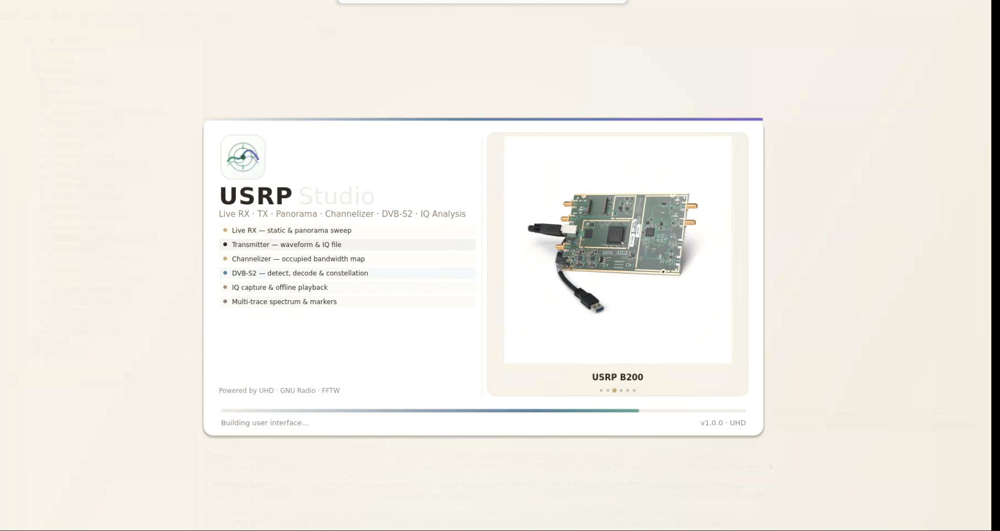
</p>

<p align="center">
  <b>End-to-end DVB-S2 receiver · Live RX · TX · Panorama · Channelizer · IQ Analysis</b><br/>
  Qt / UHD workbench for USRP software-defined radios
</p>

> **SpectraLab includes an end-to-end DVB-S2 receiver implementation.** It goes from raw IQ
> through symbol / carrier synchronization and PLHEADER decoding, then PL descrambling, soft
> demapping, LDPC and BCH decoding, BBHEADER processing, and finally MPEG-TS / Generic Stream
> reassembly into playable services.
> The CCM path has been validated end-to-end on **real satellite captures**. Coverage of every
> DVB-S2 mode, and the validation status of each, is listed in
> [§7](#7-dvb-s2-implementation-coverage--validation).
>
> Around the receiver, SpectraLab is a general USRP workbench: live spectrum, wideband panorama,
> channelizer, IQ capture / playback, and TX.
> DVB-S2 support is **receive-only**: the TX modes send tones / waveforms or replay IQ files and
> do not include a DVB-S2 modulator.

| | |
|:--|:--|
| **Binary** | `SpectraLab` |
| **Stack** | Qt 6 · UHD · FFTW3 · Boost |
| **Hardware** | USRP B200 / B210 / B200mini / N310 (UHD-compatible) |
| **Version** | 1.0.0 |
| **Source** | Private — available on request ([details](#source-code-availability)) |

<details>
<summary><b>Startup splash previews</b> (shown while the UI loads)</summary>
<br/>

| Channelizer concept | DVB-S2 / APSK |
|:--:|:--:|
| 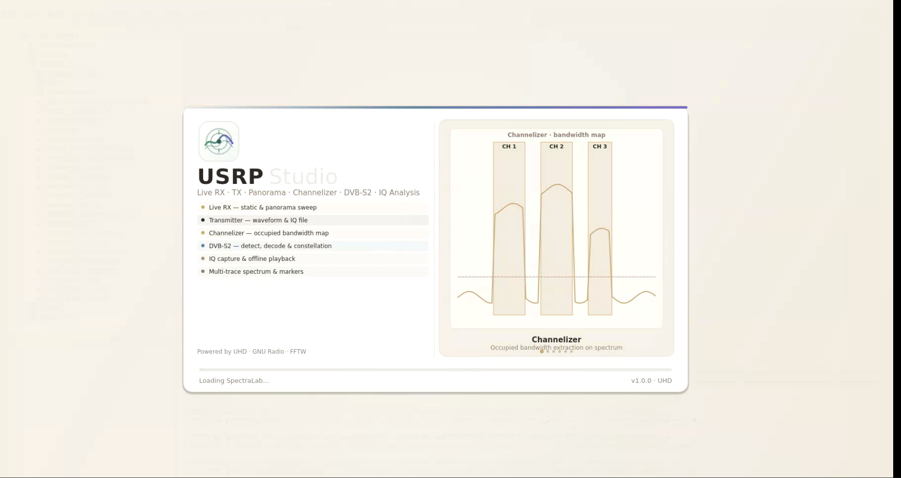 | 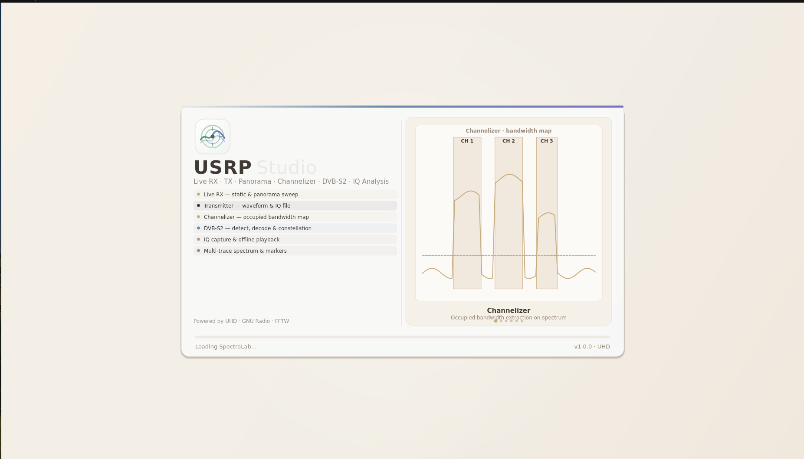 |

</details>

---

## Source code availability

> [!NOTE]
> The SpectraLab source code is currently kept in a **private** repository.
> If you would like access (research, evaluation, or collaboration), please
> **open an issue** in [SpectraLab-docs](https://github.com/mohammadHaghpanah/SpectraLab-docs/issues)
> titled *“Source access request”* with a short note about your intended use,
> or contact [@mohammadHaghpanah](https://github.com/mohammadHaghpanah) on GitHub.

---

## Table of contents

1. [Features](#1-features-coarse--fine)
2. [Operating modes](#2-operating-modes)
3. [Notation & units](#3-notation--units)
4. [IQ file format](#4-iq-file-format)
5. [Visualization & measurement](#5-visualization--measurement-tools)
6. [DVB-S2 — frames & receiver](#6-dvb-s2--frames-bits-algorithm-blocks-and-our-receiver)
7. [DVB-S2 implementation coverage & validation](#7-dvb-s2-implementation-coverage--validation)
8. [DVB-S2 challenges](#8-dvb-s2-challenges-we-solved)
9. [DVB-S2 outputs](#9-dvb-s2-outputs)
10. [Channelizer math](#10-channelizer--mathematical-description)
11. [Panorama algorithm](#11-panorama--sweep--stitch-algorithm)
12. [Build & run](#12-build--run)
13. [Demo media](#13-demo-media)
14. [References](#14-references)

---

## 1. Features (coarse → fine)

> From live spectrum to recovered TV services: receive, map occupied bandwidth, and decode DVB-S2.

### 1.1 Product-level capabilities

- **Live RF receive** on a fixed LO (Live RX) with continuous streaming spectrum.
- **Wideband panorama** by LO stepping / stitching across a frequency range.
- **Transmit** continuous waveforms or IQ file replay.
- **Full-duplex TX/RX** on dual-port USRPs (e.g. B200: TX on TX/RX, RX on RX2).
- **IQ capture** to disk (`.sig`, raw interleaved IQ — [§4](#4-iq-file-format)) with optional selective bandwidth.
- **Offline IQ playback** with spectrum, measurements, Channelizer, and DVB-S2.
- **Channelizer** — automatic / manual noise floor + occupied-bandwidth channel map.
- **End-to-end DVB-S2 receiver** — IQ → sync → PLHEADER → LDPC / BCH → BBHEADER → TS / GS, with CCM and ACM decode paths. Implementation coverage and validation evidence: [§7](#7-dvb-s2-implementation-coverage--validation).
- **Measurement panel** — multi-trace spectrum, peaks, persistence, markers, colormap editor.

### 1.2 Receive / transmit / capture

| Feature | Detail |
|--------|--------|
| Live RX | Continuous RX until Stop; time / frequency / waterfall plots |
| Live retune | Change $f_c$ / gain while RX is running |
| Master clock / $F_s$ table | Family-aware sample-rate combos (B200, N3xx, …) |
| Twin RX params | RX1 / RX2 center, gain, antenna |
| Transmitter | Tone / waveform or IQ file replay; gain, $f_c$, $F_s$ (no built-in DVB-S2 modulator) |
| TX/RX mode | Shared $f_c$ / $F_s$ page; simultaneous TX + RX |
| IQ capture | Timed capture to `.sig`; full band or marked band |
| Offline | Replay raw IQ (`float32` / `double64` / int16); seek, pause, auto-repeat |

### 1.3 Analysis

| Feature | Detail |
|--------|--------|
| Channelizer | ROI on spectrum → noise floor → occupied-BW islands |
| DVB-S2 band select | Approximate Place Lines → automatic occupied-BW refine |
| DVB-S2 Online | Live RX: capture IQ → Place Lines → Analyze / FEC (same decoder as Offline) |
| DVB-S2 Offline | File Playback: full-file / chunked FEC with session-persistent TS reassembly |
| Constellation | Live / result constellation dialogs |
| Channel list | SDT / ffprobe names, logos, live SPTS stream to player |
| Generic Stream | Hex viewer + `.gs.bin` / GSE dump path |

### 1.4 DVB-S2 FEC highlights (fine)

- SOF correlation + Joint-90 PLHEADER / PLSC decode (π/2-BPSK, (64,7) bi-orthogonal PLS).
- Per-frame MODCOD / short / pilots (**ACM**) or locked settings (**CCM**).
- Soft demap (QPSK / 8PSK / 16APSK / 32APSK) → bit deinterleave → LDPC → BCH → BB descramble.
- BBHEADER CRC-8, MATYPE (ACM/CCM bit), UPL / DFL / SYNC / SYNCD.
- Transport Stream reassembly (188-byte packets) **and** Generic Stream bit packing.
- Pilot strip + per-slot phase correction when pilots are present.

---

## 2. Operating modes

SpectraLab starts with a **Live USRP** vs **File Playback** choice, then offers these work modes:

<p align="center">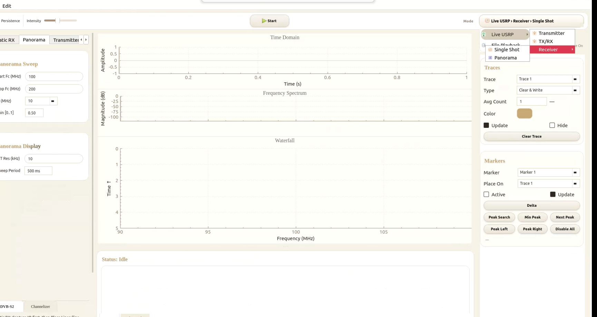</p>

### 2.1 Live Receiver (Live RX)

Fixed center frequency, continuous IQ streaming into spectrum / waterfall.
Use for monitoring a known band, IQ capture, Channelizer, and DVB-S2 Online (buffer live IQ, then run the same FEC stack as Offline).

**Typical flow:** Find Devices → set $F_s$ / $f_c$ / gain → **Start** → (optional) Place Lines → Channelizer or DVB-S2 Analyze.

### 2.2 DVB-S2 Online and Offline

The same DVB-S2 PHY + FEC code runs on both data sources; only the way IQ arrives differs:

| Mode | How IQ is obtained | DVB-S2 usage |
|------|-------------------|--------------|
| **Online (Live USRP)** | Live RX stream; timed IQ capture into RAM | Place Lines → Analyze → TS / GS / constellation |
| **Offline (File Playback)** | Recorded IQ from disk ([§4](#4-iq-file-format)) | Full-file or windowed Analyze; chunked FEC with persistent reassembly |

Real-signal verification so far was done in **Offline** mode — see [§7](#7-dvb-s2-implementation-coverage--validation).

### 2.3 Panorama

<p align="center">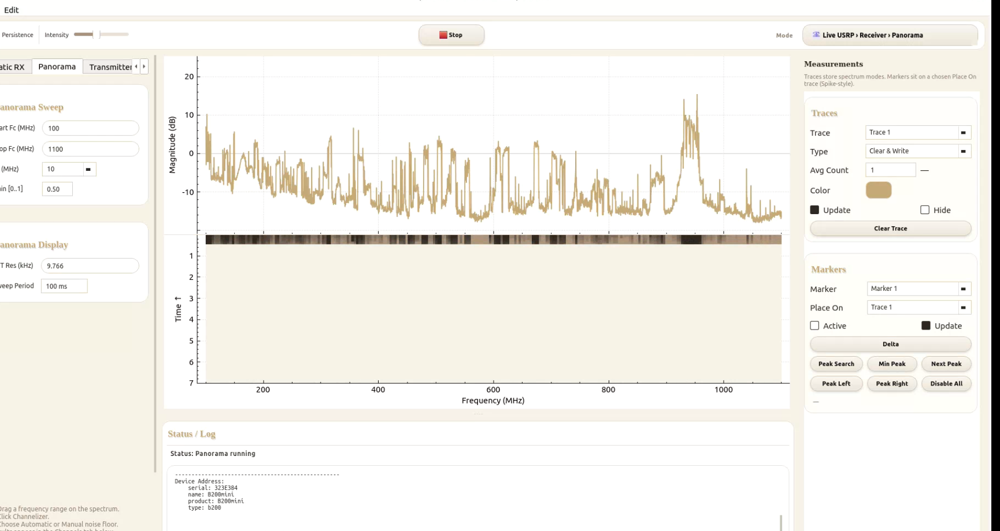</p>

<p align="center">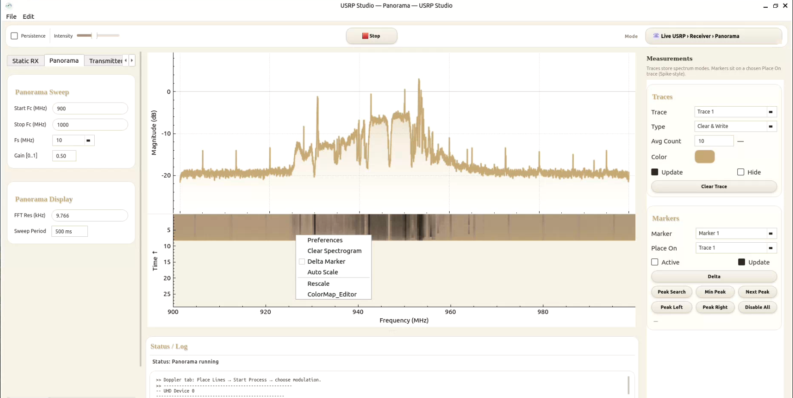</p>

Wideband monitoring by **LO stepping**: the radio tunes successive centers from **Start Fc** to **Stop Fc**, captures a short IQ burst at each slot, runs an FFT, then **stitches** slot spectra into one panoramic trace and a matching waterfall.

| Control | Role |
|---------|------|
| Start Fc / Stop Fc | Sweep span (MHz) |
| Fs | Per-slot sample rate → slot RF bandwidth |
| Gain | Normalized RX gain for the sweep |
| FFT Res / FFT size | Frequency resolution $\Delta f = F_s / N$ |
| Sweep Period | Pause / cadence between LO hops |

The DVB-S2 tab is hidden here (decode needs a stable LO and continuous IQ). Math: [§11](#11-panorama--sweep--stitch-algorithm).

<video src="docs/media/demo_panorama.webm" controls width="720"></video>

### 2.4 Transmitter

Generates a continuous tone / waveform or replays an IQ file through the USRP TX chain.

### 2.5 TX / RX (full duplex)

Combined control page for simultaneous transmit and receive (antenna conflict checks; B200 typically TX on TX/RX, RX on RX2).

### 2.6 Offline (File Playback)

Replays a recorded IQ file through the same spectrum / Channelizer / DVB-S2 pipeline as live — without a radio.
Supports seek, pause, progress bar, and auto-repeat. Playback is paced to approximately real time using the entered $F_s$.
File layout, scaling, and how $F_s$ / $f_c$ are set: [§4](#4-iq-file-format).

<video src="docs/media/demo_offline_playback.webm" controls width="720"></video>

---

## 3. Notation & units

All formulas in this README use the symbols below. Frequencies are in Hz in formulas and in MHz on plot axes.

| Symbol | Meaning | Unit |
|:--:|---|:--:|
| $I[n],\,Q[n]$ | Internal IQ sample (signed 16-bit, range $-32768 \ldots 32767$) | counts |
| $\tilde{x}[n]$ | Normalized complex sample $\tilde{x}[n] = \bigl(I[n] + jQ[n]\bigr)/32768$ | full scale (FS) |
| $F_s$ | Sample rate | Hz |
| $f_c$ | Center (LO) frequency | Hz |
| $N$ | FFT length | samples |
| $w[n]$ | Hamming window, coherent gain $\tfrac{1}{N}\sum_n w[n] \approx 0.54$ | — |
| $X[k]$ | Windowed DFT, fft-shifted so DC is at the center bin | FS |
| $\Delta f$ | Bin spacing $\Delta f = F_s/N$ | Hz |
| $f[k]$ | Absolute frequency of bin $k$ | Hz |
| $A[k]$ | Normalized amplitude $A[k] = \lvert X[k]\rvert / N$ | FS (linear) |
| $P[k]$ | Normalized power $P[k] = A[k]^2$ | FS² (linear) |
| $L[k]$ | Level in **dBFS** (Live RX / Offline display) | dBFS |
| $D[k]$ | Level in **dB (rel.)** (Panorama, Channelizer capture) | dB (rel.) |
| $t$ | Frame (FFT) index | — |
| $M$ | Trace **Avg Count** | frames |
| $\alpha$ | EMA weight ($0 < \alpha \le 1$) | — |

### 3.1 Spectrum definitions

$$
X[k] \;=\; \sum_{n=0}^{N-1} w[n]\,\tilde{x}[n]\,e^{-j2\pi kn/N},
\qquad
f[k] \;=\; f_c - \frac{F_s}{2} + k\,\Delta f,
\qquad k = 0,\dots,N-1
$$

**Amplitude and power give the same dB number.** SpectraLab never mixes the two:

$$
\boxed{\;L[k] \;=\; 20\log_{10} A[k] \;=\; 10\log_{10} P[k]\quad[\mathrm{dBFS}]\;}
$$

> **Reference.** 0 dBFS is a complex sinusoid of amplitude 1 FS (int16 full scale) with $w[n]\equiv 1$.
> The Hamming coherent gain is **not** compensated, so a full-scale tone centered on a bin reads
> $20\log_{10}(0.54) \approx -5.4$ dBFS. Noise-floor readings depend on $N$ (they fall by 3 dB per doubling of $N$).

### 3.2 Vertical-axis unit of every plot

| Plot | Quantity | Formula | Y unit |
|------|----------|---------|:--:|
| Time (Live / Offline) | $\tilde{I}[n],\ \tilde{Q}[n]$ | $I/32768,\ Q/32768$ | FS ($-1\ldots 1$) |
| Frequency (Live / Offline) | $L_t[k]$ | $20\log_{10}\!\bigl(\lvert X_t[k]\rvert/N\bigr)$ | dBFS |
| Waterfall (Live / Offline) | $L_t[k]$, max-pooled to the row width | same as above | dBFS (color) |
| Traces (Average / Max / Min) | applied to $L_t[k]$ ([§5.3](#53-averaging-in-the-display)) | dB-domain processing | dBFS |
| Panorama spectrum / waterfall | $D[k]$ ([§11.3](#113-stitch--ema)) | $10\log_{10}\overline{\lvert X\rvert}$ | dB (rel.) |
| Channelizer PSD / thresholds | $D[k]$ ([§10.1](#101-spectrum-grid-and-input-level)) | $10\log_{10}\overline{\lvert X\rvert}$ | dB (rel.) |
| Constellation | Soft symbols, unit-power normalized | — | linear |

### 3.3 dBFS vs dB (rel.)

Panorama and the Channelizer capture apply $10\log_{10}$ to the **averaged magnitude** $\overline{\lvert X[k]\rvert}$ without the $1/N$ factor. Relative to the dBFS scale this gives (single frame, before averaging):

$$
D[k] \;=\; 10\log_{10}\lvert X[k]\rvert \;=\; \tfrac{1}{2}\,L[k] \;+\; 10\log_{10} N
$$

**Practical consequences:**

- On dB (rel.) plots, level **differences are half** their dBFS value. A carrier 20 dB above the noise on the Live RX plot shows about 10 dB above the noise on Panorama.
- Absolute dB (rel.) values shift with $N$, so compare levels only at the same FFT size.
- The Channelizer margins ($T_{\mathrm{margin}} = 1$ dB, edge scores 1.5 / 0.5 dB) are defined on this scale. They correspond to about twice those values in dBFS.

---

## 4. IQ file format

SpectraLab reads and writes **headerless, raw, interleaved IQ**. Nothing about the signal is stored inside the file.

### 4.1 Layout

```
byte 0                                                        EOF
│ I₀ │ Q₀ │ I₁ │ Q₁ │ I₂ │ Q₂ │ …                     │ I_{K-1} │ Q_{K-1} │
└─ one complex sample = (I, Q), I first ─┘
```

| Property | Value |
|----------|-------|
| **I/Q order** | Interleaved, **I first**: `I₀ Q₀ I₁ Q₁ …` |
| **Header** | **None.** Every byte is sample data (no SigMF/WAV/metadata parsing); a prepended header would be decoded as samples |
| **Endianness** | **Host native**, no byte swapping → **little-endian** on x86-64 / ARM Linux. Big-endian files must be byte-swapped beforehand |
| **Sample count** | $K = \text{file size} / \text{bytes per complex sample}$ |
| **Fs / Fc** | **Not stored** — entered by the user (see §4.4) |

### 4.2 Reading (File Playback)

Choose the type in the Source panel → **File Type**. Every type is converted to the internal signed 16-bit format with the **IQ Gain** $g$ (default $g = 1.0$):

| File Type (UI) | Component type | Bytes / complex sample | Expected range | Conversion to internal $I$ (same for $Q$) |
|---|---|:--:|:--:|---|
| `float32` *(default)* | IEEE-754 float32 | 8 | $\pm 1.0$ FS | $I = \mathrm{trunc}\bigl(\mathrm{clamp}(v \cdot 32767\,g)\bigr)$ |
| `double64` | IEEE-754 float64 | 16 | $\pm 1.0$ FS | $I = \mathrm{trunc}\bigl(\mathrm{clamp}(v \cdot 32767\,g)\bigr)$ |
| `uint16` | **signed** int16, two’s complement | 4 | $\pm 32767$ | $I = \mathrm{trunc}\bigl(\mathrm{clamp}(v \cdot g)\bigr)$ |

$\mathrm{clamp}(\cdot)$ limits to $[-32768,\,32767]$ and $\mathrm{trunc}$ rounds toward zero.

> [!IMPORTANT]
> The `uint16` entry is a historical label: samples are interpreted as **signed** 16-bit integers
> (the format USRP/UHD `sc16` produces). Truly unsigned (offset-binary) files must be converted first.

> [!TIP]
> Floating-point files should be scaled so that full scale is about $\pm 1.0$. Use **IQ Gain** to compensate
> recordings that are much weaker (raise $g$) or that would clip at $\pm 32767$ (lower $g$).

### 4.3 Writing (IQ capture → `.sig`)

| Property | Value |
|----------|-------|
| Format (default) | `float32` interleaved I/Q, value $= I/32768$ (range $[-1, 1)$) |
| Format (option) | Raw signed int16 interleaved I/Q, when the `File_DataType` parameter is `short` |
| Header / endianness | None / host native (little-endian) |
| File name | `RX1_FC<fc MHz>_FS<Fs MHz>[_BW<bw>MHz]_yyyy-MM-dd_hh:mm:ss.sig` (RX2 likewise) |

A default capture replays correctly with **File Type = `float32`** and **IQ Gain = 1.0**.

### 4.4 How $F_s$ and $f_c$ are determined

- Both are **entered manually** in the File Playback Source panel. Defaults are $F_s = 10$ MHz and $f_c = 100$ MHz.
- Neither is read from the file name or contents. Capture file names carry `FC…` / `FS…` only as a human-readable record, so copy those values into the panel.
- $F_s$ must be **exact**. It sets $\Delta f$, the frequency axis, the playback pacing, and the DVB-S2 symbol-rate search.
- $f_c$ only labels the axis: it moves absolute frequencies on the plots and in the Channelizer table, but it does not change any processing.

---

## 5. Visualization & measurement tools

### 5.1 Plot stack (Live RX / Offline)

Three synchronized plots share the same RF center and span (units: [§3.2](#32-vertical-axis-unit-of-every-plot)):

| Plot | What it shows | How it is built |
|------|---------------|-----------------|
| **Time** | $\tilde{I}$, $\tilde{Q}$ vs time | Short IQ window from the RX / playback ring buffer |
| **Frequency** | $L_t[k]$ in dBFS vs MHz | Hamming window → FFT → $20\log_{10}(\lvert X\rvert/N)$, then **trace processing** (§5.2) |
| **Waterfall** | Time history of $L_t[k]$ | Each FFT row is max-pooled to a fixed width and written into a **circular color map**; Y is time (newest at top) |

Frequency ↔ waterfall **X-axes stay locked** (zoom one, the other follows). Rubber-band zoom and double-click reset work on both. A screenshot of the full plot stack with Channelizer overlays is in [§10](#10-channelizer--mathematical-description).

### 5.2 Spectrum traces (how they work)

The right-hand **Traces** panel (`SpectrumTraces`) manages up to **six** independent curves on the frequency plot. Each new FFT row $L_t[k]$ (dBFS) is fed into every enabled trace according to that trace’s **Type**.

**Panel fields**

| Control | Meaning |
|---------|---------|
| **Trace** | Select which slot (Trace 1…6) you are editing |
| **Type** | Processing mode (Clear & Write, Max Hold, …) |
| **Avg Count** | $M$ — used only when Type = Average |
| **Color** | Pen color for that trace |
| **Update** | ON → accept new FFTs; OFF → freeze the curve in place |
| **Hide** | Hide the curve without clearing its buffer |
| **Clear Trace** | Reset that trace’s memory (holds / average / buffer) |

**Type behaviors** ($y[k]$ is the drawn curve)

| Type | Per-bin update | Typical use |
|------|----------------|-------------|
| **Clear & Write** | $y[k] = L_t[k]$ (no memory) | Live monitoring |
| **Max Hold** | $y[k] \leftarrow \max\bigl(y[k],\, L_t[k]\bigr)$ | Catch bursts, hoppers, intermittent carriers |
| **Min Hold** | $y[k] \leftarrow \min\bigl(y[k],\, L_t[k]\bigr)$ | Noise-floor envelope over time |
| **Min/Max Hold** | Keep both envelopes | Peak-to-floor span of a band |
| **Average** | EMA with $\alpha = 1/M$ (§5.3) | Reduce variance; stable marker readouts |
| **Off** | Not drawn | Free a slot |

**How to use traces in practice**

1. Leave **Trace 1** on **Clear & Write** for the live view.
2. Enable **Trace 2**, set **Max Hold**, and watch rare spikes accumulate.
3. Enable **Trace 3**, set **Average** with Avg Count 10–50 for a smooth reference.
4. Assign distinct colors so Max Hold and Average stay readable.
5. Turn **Update** off on a trace to freeze a reference snapshot while the others keep running.

Traces do **not** feed Channelizer / DVB-S2; those tools read the IQ path separately. Markers (§5.4) can read any trace via **Place On**.

### 5.3 Averaging in the display

With Type = **Average** and Avg Count $M$, each bin is smoothed in the **dB domain**:

$$
\boxed{\;\alpha = \frac{1}{M},\qquad
\bar{L}_{t}[k] = (1-\alpha)\,\bar{L}_{t-1}[k] + \alpha\, L_{t}[k]\quad[\mathrm{dBFS}]\;}
$$

> **Reading the formula.** Each bin mixes a fraction $\alpha$ of the newest dBFS value with the previous average. A larger $M$ gives a smaller $\alpha$, so the display becomes smoother and slower.

- Because the average is taken on dB values (a log-average), a pure-noise floor reads about **2.5 dB lower** than a linear-power average would. Carriers well above the noise are not affected.
- The FFT engine itself runs **without** averaging in Live RX / Offline: each row is one FFT ($\alpha_{\mathrm{FFT}} = 1$). All smoothing comes from the trace.
- A frame counter climbs toward $M$ so you can see when the average has warmed up.
- Switching away from Average **clears** the EMA, so Clear/Write and Hold modes do not inherit old smoothing.
- **Update** off freezes the averaged curve (a stable baseline for Delta markers).

Panorama additionally applies a **linear-magnitude** EMA per bin while stitching ($\alpha = 0.1$, [§11.3](#113-stitch--ema)) before its traces run.

### 5.4 Markers & peak tools

Markers are measurement points on the **frequency** plot (same right-hand dock). Each marker is tied to one **trace** and reports frequency plus level (and optional delta).

**Panel fields**

| Control | Behavior |
|---------|----------|
| **Marker** | Select which marker instance to edit |
| **Place On** | Which **trace** (1…6) supplies the level at the marker frequency |
| **Active** | Show / enable that marker |
| **Update** | ON → Y follows the live Place-On trace at fixed X; OFF → freeze the level |
| **Delta** | Arm reference mode: the next placement stores $(f_0, y_0)$; readout becomes $\Delta f$, $\Delta y$ |
| **Peak Search** | Find the global maximum on the Place-On trace; build an ordered peak list |
| **Min Peak** | Global minimum on that trace |
| **Next Peak** | Jump to the next entry in the peak list |
| **Peak Left / Peak Right** | Move to the neighboring peak in frequency |
| **Disable All** | Clear every marker |

**Placement & tracking**

1. Choose **Marker** and set **Place On** to the trace you care about (e.g. Average for a stable level, Max Hold for peak level).
2. **Peak Search** jumps to the strongest bin; or **left-click** the spectrum to place manually (X locked to the click frequency).
3. With **Update** ON the marker value tracks that trace as FFTs arrive; with OFF you keep a frozen value.
4. **Delta**: click Delta, then place / peak-search a second point. The readout shows the spacing in MHz and the level difference in dB.
5. **Peak Left/Right / Next** walk multi-carrier peak lists without re-searching from scratch.

**Recipes**

| Goal | Setup |
|------|--------|
| Read a stable carrier level | Trace = Average, Place On that trace, Peak Search, Update ON |
| Measure the peak of a bursty signal | Trace = Max Hold, Peak Search |
| Channel spacing between two tones | Peak Search on first → Delta → Peak Right (or click the second) |
| Compare live vs held | Trace 1 Clear & Write + Trace 2 Max Hold; two markers, Place On 1 and 2 |

Readouts are in MHz and in the plot’s own unit: **dBFS** on Live RX / Offline and **dB (rel.)** on Panorama ([§3.3](#33-dbfs-vs-db-rel)). Markers never change the RF path; they only measure displayed traces.

### 5.5 Waterfall details

- Backing store: ring buffer of spectrum rows → `QCPColorMap`.
- Color encodes the plot level (dBFS on Live RX / Offline, dB (rel.) on Panorama). The color range and **colormap** are editable (Preferences / Colormap Editor).
- Horizontal zoom stays tied to the frequency plot; vertical zoom changes how much history is visible.
- In Panorama, each completed sweep writes one panoramic row.

### 5.6 Persistence / intensity

Optional **persistence** layer under the live spectrum: recent FFT frames accumulate as a density / afterglow map. The intensity slider scales how strongly old energy remains visible — useful for hopping or bursty signals without switching to Max Hold.

### 5.7 Band markers (Place Lines)

Two-click vertical markers on the frequency plot define a **search region**:

1. Arm **Place Lines** — a dashed line follows the mouse.
2. Click the **start**, then the **end** frequency.
3. The band is used for selective IQ capture, the Channelizer ROI, and DVB-S2 Analyze (approximate box → automatic occupied-BW refine).

### 5.8 Channelizer overlays

After the Channelizer runs, the frequency plot shows:

- Semi-transparent **occupied-bandwidth** rectangles per detected channel
- An optional **noise-floor** reference
- Channel table rows (center, BW, …)

Screenshot and algorithm: [§10](#10-channelizer--mathematical-description).

### 5.9 Colormap editor

Custom transfer curves for the Live RX and Panorama waterfalls (presets, gamma, invert). Demo: [demo_panorama_colormap.webm](docs/media/demo_panorama_colormap.webm).

### 5.10 DVB-S2 result UI

- **Results** — MODCOD, ACM/CCM, $R_s$, roll-off, EVM, FEC stats (`FULL_LOCK` banner when synced)
- **Constellation** — live / final soft symbols (QPSK / 8PSK / APSK)
- **Recovered media** — PAT/PMT/SDT services, Play / Listen, TS / hex / pcap / folder
- **Generic Stream** — hex viewer + `.gs.bin`

Screenshots: [§9](#9-dvb-s2-outputs).

---

## 6. DVB-S2 — frames, bits, algorithm blocks, and our receiver

DVB-S2 (ETSI EN 302 307) packages baseband packets into **FEC frames**, maps them to complex symbols (**XFECFRAME**), then wraps them in a **PLFRAME** with a robust header and optional pilots.

SpectraLab implements the complete DVB-S2 **receive chain, from IQ to payload**:

1. **Band select** — Place Lines (approximate) on the Live or Offline spectrum.
2. **Occupied-BW refine** — automatic decoder bandwidth from the PSD.
3. **PHY sync** — symbol timing, $R_s$ search, CFO / phase, SOF detection.
4. **PLHEADER** — SOF (26 symbols) + PLS (64 symbols) via Joint-90; MODCOD / short / pilots.
5. **FEC** — PL descramble → soft demap → deinterleave → LDPC → BCH → BB descramble.
6. **BBHEADER** — 80-bit header (CRC-8, MATYPE ACM/CCM, UPL/DFL/SYNC/SYNCD).
7. **Payload** — MPEG-TS reassembly and/or Generic Stream dump.
8. **UI** — constellation, results, recovered media / player.

“Complete receive chain” means every stage from IQ to TS / GS is implemented. It does **not** mean every DVB-S2 mode has been validated: per-mode status is in [§7](#7-dvb-s2-implementation-coverage--validation).

Figures below are from **ETSI EN 302 307 V1.2.1** (official frame drawings). Project MATLAB / report pages: `docs/media/dvbs2_report-*.png`.

### 6.1 Official TX functional blocks (ETSI Figure 1)

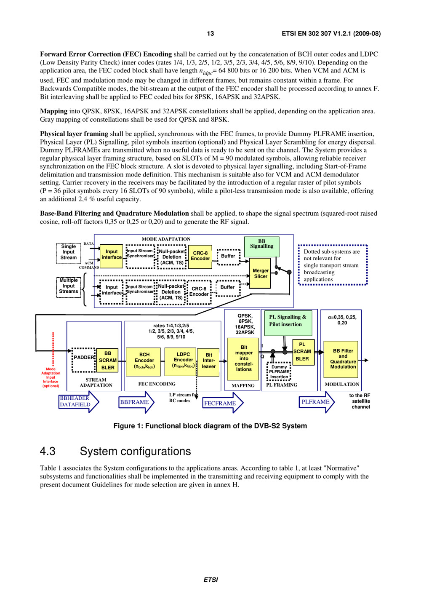

Frame names evolve left → right on the diagram:

| Stage | Output name | Size (core) |
|-------|-------------|-------------|
| Mode adaptation | BBHEADER + DATA FIELD | Header **80 bits** |
| Stream adaptation | **BBFRAME** | $K_{\mathrm{bch}}$ bits |
| FEC (BCH+LDPC+interleave) | **FECFRAME** | **64 800** or **16 200** bits |
| Mapping | **XFECFRAME** | $n_{\mathrm{ldpc}}/\eta_{\mathrm{MOD}}$ symbols |
| PL framing + scramble | **PLFRAME** | see §6.5 |

#### Transmitter algorithm blocks (standard)


```mermaid
flowchart LR
  IN["Input stream(s)<br/>TS / Generic / ACM cmd"] --> MA["Mode Adaptation<br/>CRC-8 · Merger/Slicer<br/>BB signalling"]
  MA --> SA["Stream Adaptation<br/>Padder · BB Scrambler"]
  SA --> FEC["FEC Encoding<br/>BCH → LDPC → Bit Interleaver"]
  FEC --> MAP["Constellation Mapping<br/>QPSK / 8PSK / 16APSK / 32APSK"]
  MAP --> PL["PL Framing<br/>PLHEADER · Slots · Pilots · PL Scramble"]
  PL --> MOD["BB Filter + Quadrature Mod<br/>RRC α = 0.35 / 0.25 / 0.20"]
  MOD --> RF["RF satellite channel"]
```

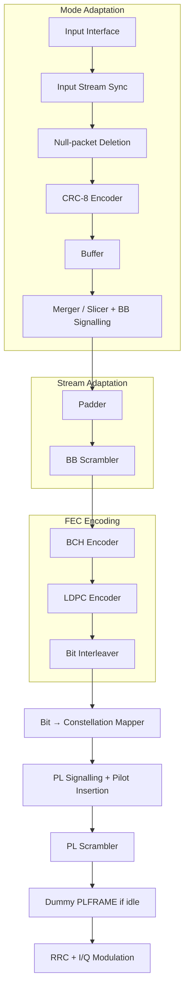
```mermaid
flowchart TB
  subgraph ModeAdapt["Mode Adaptation"]
    II[Input Interface] --> ISS[Input Stream Sync]
    ISS --> NPD[Null-packet Deletion]
    NPD --> CRC[CRC-8 Encoder]
    CRC --> BUF[Buffer]
    BUF --> MS[Merger / Slicer + BB Signalling]
  end
  subgraph StreamAdapt["Stream Adaptation"]
    PAD[Padder] --> BBS[BB Scrambler]
  end
  subgraph FecEnc["FEC Encoding"]
    BCH[BCH Encoder] --> LDPC[LDPC Encoder]
    LDPC --> INT[Bit Interleaver]
  end
  MS --> PAD
  BBS --> BCH
  INT --> MAP2[Bit → Constellation Mapper]
  MAP2 --> PLSIG[PL Signalling + Pilot Insertion]
  PLSIG --> PLSCR[PL Scrambler]
  PLSCR --> DUM[Dummy PLFRAME if idle]
  DUM --> RRC[RRC + I/Q Modulation]
```

### 6.2 BBHEADER + DATA FIELD — bit partition (ETSI Figure 3)

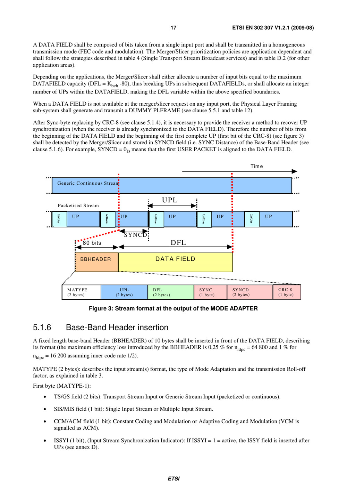

**BBHEADER = 80 bits = 10 bytes** (fixed), then a **DATA FIELD** of length **DFL** bits:

| Field | Bits | Bytes | Content |
|-------|-----:|------:|---------|
| **MATYPE** | 16 | 2 | TS/GS (2), SIS/MIS (1), **CCM/ACM (1)**, ISSYI (1), NPD (1), RO α (2); + ISI / reserved |
| **UPL** | 16 | 2 | User Packet Length in bits (MPEG-TS: $188\times 8 = 1504$) |
| **DFL** | 16 | 2 | Data Field Length in bits ($0 \ldots 58112$) |
| **SYNC** | 8 | 1 | Copied sync byte |
| **SYNCD** | 16 | 2 | Bits from start of DATA FIELD to first complete UP |
| **CRC-8** | 8 | 1 | CRC over first 9 header bytes |
| **Σ header** | **80** | **10** | |
| **DATA FIELD** | DFL | — | Payload bits from one input port / one MODCOD |

**MATYPE CCM/ACM bit:** `1` = CCM, `0` = ACM (VCM is signalled as ACM). SpectraLab reads this bit after a short PL probe to choose the CCM or ACM decode path (§8.2).

### 6.3 BBFRAME format (ETSI Figure 4)

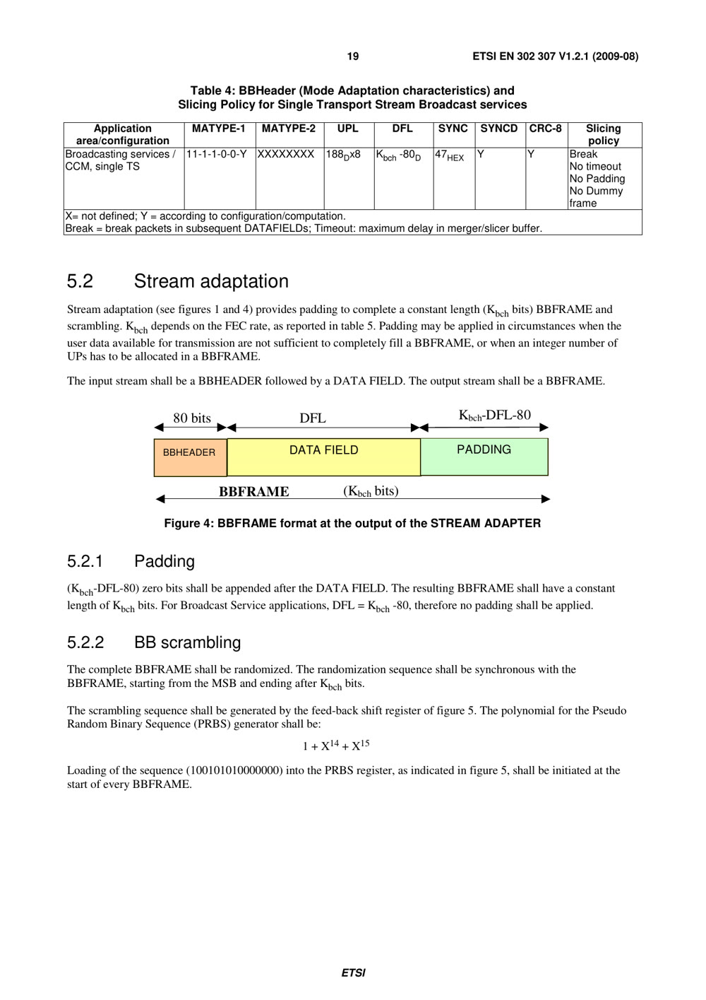

$$
\mathrm{BBFRAME} \;=\; \underbrace{\mathrm{BBHEADER}}_{80\ \mathrm{bits}}
\;+\;
\underbrace{\mathrm{DATA\ FIELD}}_{\mathrm{DFL\ bits}}
\;+\;
\underbrace{\mathrm{PADDING}}_{K_{\mathrm{bch}}-80-\mathrm{DFL}}
\quad\Longrightarrow\quad
\bigl|\mathrm{BBFRAME}\bigr| = K_{\mathrm{bch}}\ \mathrm{bits}
$$

Then BB scramble → BCH → LDPC → (optional) bit interleave → constellation map.

### 6.4 FECFRAME / XFECFRAME sizes

| | Normal frame | Short frame |
|--|-------------:|------------:|
| FECFRAME $n_{\mathrm{ldpc}}$ | **64 800 bits** | **16 200 bits** |
| XFECFRAME symbols | $64800/\eta_{\mathrm{MOD}}$ | $16200/\eta_{\mathrm{MOD}}$ |

$\eta_{\mathrm{MOD}}$ (bits per symbol): QPSK = 2, 8PSK = 3, 16APSK = 4, 32APSK = 5.

**Table 11 — number of 90-symbol SLOTs $S$ per XFECFRAME**

| $\eta_{\mathrm{MOD}}$ | $S$ (normal) | $S$ (short) |
|--:|--:|--:|
| 2 (QPSK) | 360 | 90 |
| 3 (8PSK) | 240 | 60 |
| 4 (16APSK) | 180 | 45 |
| 5 (32APSK) | 144 | 36 |

### 6.5 PLFRAME — full partition (ETSI Figure 13)

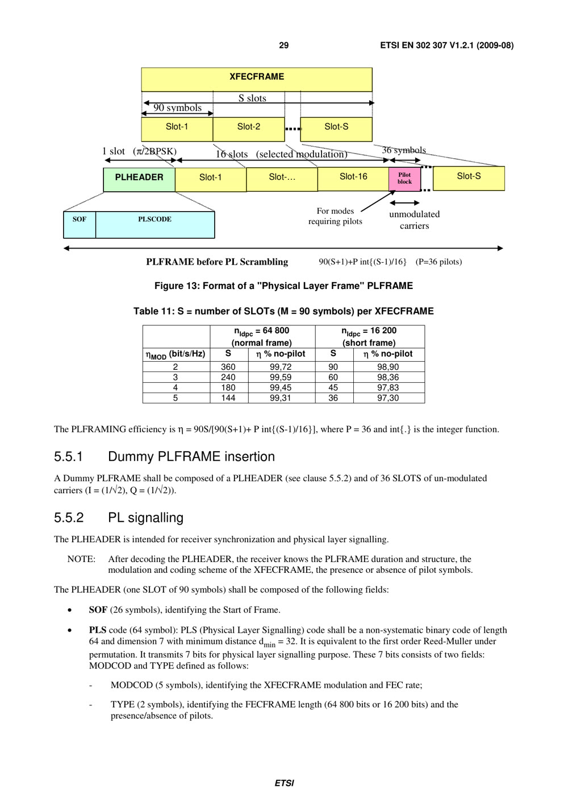

```
PLFRAME (before PL scramble)
├── PLHEADER          1 SLOT = 90 symbols  (π/2-BPSK)
│   ├── SOF           26 symbols
│   └── PLSCODE       64 symbols   ← encodes 7 info bits (MODCOD 5 + TYPE 2)
├── Slot-1 … Slot-16  90 symbols each (payload modulation)
├── Pilot block       36 symbols   (if TYPE.pilots = 1)
├── Slot-17 …         …
└── … Slot-S
```

Length in symbols ($P = 36$ with pilots, $P = 0$ without):

$$
L_{\mathrm{PL}} \;=\; 90\,(S+1) \;+\; P\left\lfloor\frac{S-1}{16}\right\rfloor,
\qquad
\eta_{\mathrm{PL}} \;=\; \frac{90\,S}{L_{\mathrm{PL}}}
$$

### 6.6 PLHEADER bit/symbol breakdown (ETSI §5.5.2)

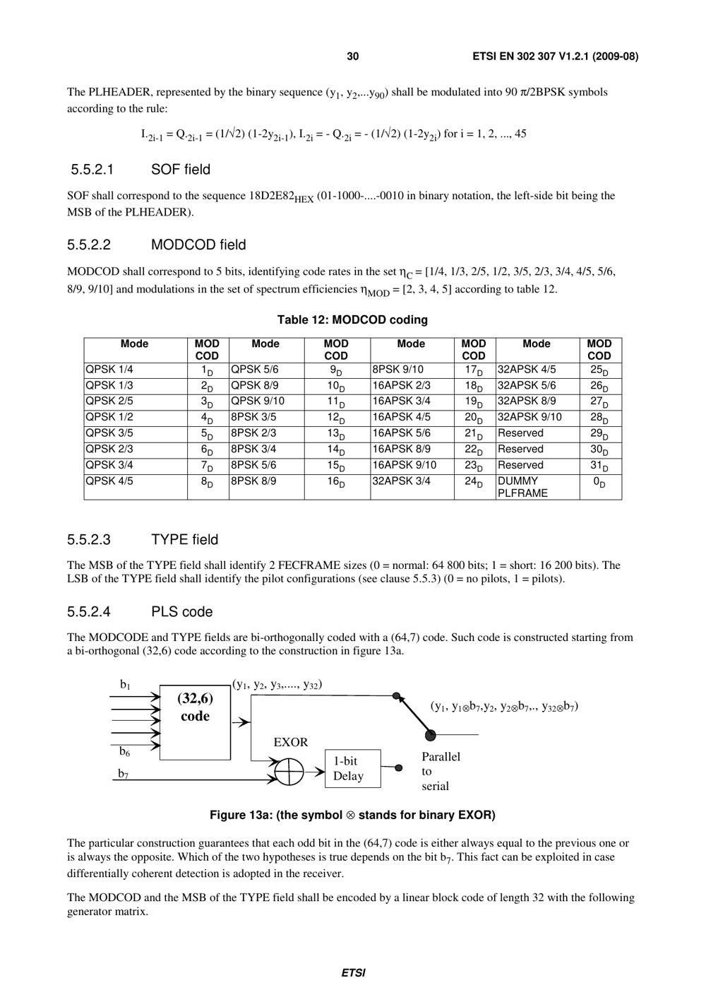

| PLHEADER part | Symbols | Signalled bits | Notes |
|---------------|--------:|---------------:|-------|
| **SOF** | **26** | fixed UW | Hex **`18D2E82`** |
| **PLSCODE** | **64** | **7** protected | (64,7) bi-orthogonal / RM-like, $d_{\min}=32$ |
| ↳ MODCOD | (inside PLS) | **5** | Modulation + code rate (Table 12) |
| ↳ TYPE | (inside PLS) | **2** | MSB: normal/short FEC; LSB: pilots on/off |
| **Total PLHEADER** | **90** | | One SLOT, π/2-BPSK |

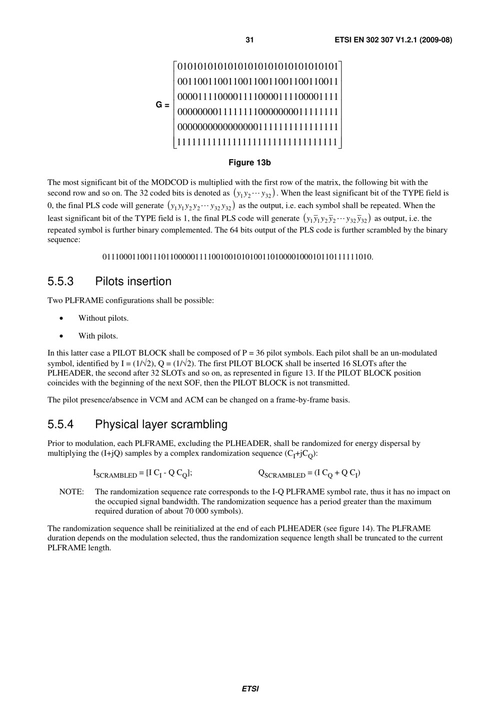

- Pilot block: **P = 36** symbols, each $(I,Q) = \bigl(1/\sqrt{2},\,1/\sqrt{2}\bigr)$.
- First pilot block after **16** payload SLOTs, then every **16** SLOTs.
- The PL scrambler resets at every PLHEADER end and does **not** scramble the header itself.

### 6.7 SpectraLab receiver algorithm blocks

This is the reverse of Figure 1, as implemented in SpectraLab (`dvbs2_*` + `fec/`).

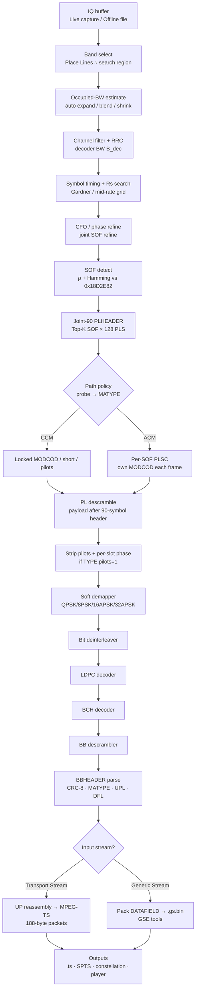
```mermaid
flowchart TB
  IQ["IQ buffer<br/>Live capture / Offline file"] --> BAND["Band select<br/>Place Lines ≈ search region"]
  BAND --> OCC["Occupied-BW estimate<br/>auto expand / blend / shrink"]
  OCC --> FILT["Channel filter + RRC<br/>decoder BW B_dec"]
  FILT --> TIM["Symbol timing + Rs search<br/>Gardner / mid-rate grid"]
  TIM --> CFO["CFO / phase refine<br/>joint SOF refine"]
  CFO --> SOF["SOF detect<br/>ρ + Hamming vs 0x18D2E82"]
  SOF --> J90["Joint-90 PLHEADER<br/>Top-K SOF × 128 PLS"]
  J90 --> PATH{"Path policy<br/>probe → MATYPE"}
  PATH -->|CCM| CCM["Locked MODCOD / short / pilots"]
  PATH -->|ACM| ACM["Per-SOF PLSC<br/>own MODCOD each frame"]
  CCM --> PLD
  ACM --> PLD["PL descramble<br/>payload after 90-symbol header"]
  PLD --> PIL["Strip pilots + per-slot phase<br/>if TYPE.pilots=1"]
  PIL --> DEM["Soft demapper<br/>QPSK/8PSK/16APSK/32APSK"]
  DEM --> DEINT["Bit deinterleaver"]
  DEINT --> LDPC["LDPC decoder"]
  LDPC --> BCH["BCH decoder"]
  BCH --> BBDES["BB descrambler"]
  BBDES --> BBH["BBHEADER parse<br/>CRC-8 · MATYPE · UPL · DFL"]
  BBH --> BR{"Input stream?"}
  BR -->|Transport Stream| TS["UP reassembly → MPEG-TS<br/>188-byte packets"]
  BR -->|Generic Stream| GS["Pack DATAFIELD → .gs.bin<br/>GSE tools"]
  TS --> OUT["Outputs<br/>.ts · SPTS · constellation · player"]
  GS --> OUT
```

#### FEC inner loop (one PLFRAME)


```mermaid
flowchart LR
  SOF2[SOF @ τ] --> PLSC[Decode PLSCODE<br/>MODCOD+TYPE]
  PLSC --> LEN["Frame length<br/>90(S+1)+P⌊(S-1)/16⌋"]
  LEN --> DSC[PL descramble]
  DSC --> XP[XFECFRAME symbols]
  XP --> SD[Soft LLRs]
  SD --> BI[Deinterleave]
  BI --> L[LDPC n=64800/16200]
  L --> BC[BCH]
  BC --> BB[BBFRAME bits]
  BB --> HDR[BBHEADER 80 bits]
  HDR --> DF[DATA FIELD DFL bits]
```

#### CCM vs ACM branch

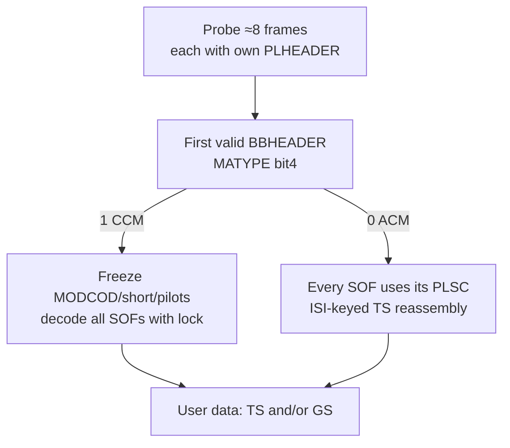
```mermaid
flowchart TB
  PROBE["Probe ≈8 frames<br/>each with own PLHEADER"] --> MAT["First valid BBHEADER<br/>MATYPE bit4"]
  MAT -->|1 CCM| LOCK["Freeze MODCOD/short/pilots<br/>decode all SOFs with lock"]
  MAT -->|0 ACM| PER["Every SOF uses its PLSC<br/>ISI-keyed TS reassembly"]
  LOCK --> DATA["User data: TS and/or GS"]
  PER --> DATA
```

Code map: `dvbs2_phy` (sync/Rs/CFO) → `dvbs2_plheader` (SOF/Joint-90) → `fec/dvbs2_fec_pipeline` (descramble→LDPC→BCH→BB) → `dvbs2_bbheader` / TS reassembler. See also `UsrpStaticRx/dvbs2/docs/CCM_ACM_PATH.md` (private repository).

---

## 7. DVB-S2 implementation coverage & validation

This section keeps two questions apart:

- **Implementation status:** does SpectraLab contain the code path for this capability?
- **Validation evidence:** how has that code path been proven to work?

**Validation evidence levels**

| Evidence | Meaning |
|---|---|
| **Real satellite captures** | Decoded end-to-end from a real satellite IQ recording: PLHEADER lock → LDPC + BCH pass → BBHEADER CRC-8 OK → MPEG-TS with valid sync bytes → services listed from PAT/PMT/SDT → at least one service **played** in an external player (cases in §7.2) |
| **Synthetic self-test** | `./SpectraLab --dvbs2-selftest` on unit vectors or synthetic IQ (gr-dvbs2rx-generated). The golden-IQ tests check PHY + PLHEADER lock (MODCOD, $R_s$, EVM), not the full FEC-to-TS path |
| **Awaiting real-capture validation** | Implemented, but not yet validated on a real signal |

### 7.1 Coverage table

| Capability | Implementation status | Validation evidence |
|---|---|---|
| **CCM** | Implemented | Real satellite captures |
| **ACM** (per-frame PLSC path) | Implemented | Awaiting real-capture validation |
| **8PSK** | Implemented | Real satellite captures (rates 3/5, 3/4) |
| **QPSK** | Implemented | Synthetic self-test (ideal demap; PHY + PLHEADER lock); awaiting real-capture validation |
| **16APSK / 32APSK** (ETSI Tables 9 / 10 radii) | Implemented | Awaiting real-capture validation |
| **Code rates** (all ETSI Table 12 MODCODs) | Implemented | 3/5 and 3/4: real satellite captures. Others: awaiting real-capture validation |
| **Normal FECFRAME** (64 800 bits) | Implemented | Real satellite captures |
| **Short FECFRAME** (16 200 bits) | Implemented | Synthetic self-test (PLSC lock only); awaiting real-capture validation |
| **Pilots on / off** | Implemented | Real satellite captures (both) |
| **SIS** (single input stream) | Implemented | Real satellite captures |
| **MIS** (ISI-keyed reassembly) | Implemented | Awaiting real-capture validation |
| **Transport Stream** (MPTS / SPTS) | Implemented | Real satellite captures (9-service MPTS and single-service) |
| **Generic Stream** (`.gs.bin` dump) | Implemented | Awaiting real-capture validation |
| **Offline** (File Playback) | Implemented | Real satellite captures |
| **Online** (Live USRP) | Implemented | Awaiting real-capture validation |

### 7.2 Real-capture test cases

| # | Signal | MODCOD | FECFRAME | Pilots | Stream | $R_s$ | EVM | Result |
|:--:|---|:--:|:--:|:--:|---|--:|--:|---|
| 1 | EUTELSAT 36B, 11105 MHz (Ku, IF capture) | 8PSK 3/5 | Normal | Off | CCM · SIS · TS | 3333 ksym/s | ≈ 14 % | `FULL_LOCK`, 1 service, playable TS |
| 2 | 11022.4 MHz (Ku), recorded at 1272 MHz IF | 8PSK 3/4 | Normal | On | CCM · SIS · TS (MPTS) | 3501.5 ksym/s | ≈ 17 % | `FULL_LOCK`, 9 services listed, TV service played in VLC |

Both cases ran in **Offline** mode from `.sig` recordings. Screenshots of these sessions are in [§9](#9-dvb-s2-outputs).

> Capabilities marked *awaiting real-capture validation* are on the validation list. The table will
> be updated as further captures (ACM, QPSK, APSK, short frames, MIS, GS, Online) are tested.

---

## 8. DVB-S2 challenges we solved

### 8.1 Approximate band selection → automatic occupied bandwidth

The user only needs to mark an **approximate** frequency region (Place Lines). The markers define a **search region**, not the final decoder filter bandwidth.

Internally (`Dvbs2Phy::synchronize`):

1. Estimate the occupied bandwidth $B_{\mathrm{occ}}$ from the PSD (peak drop + floor).
2. Compare $B_{\mathrm{occ}}$ with the marker width $B_{\mathrm{search}}$:
   - Markers **clip** the carrier ($B_{\mathrm{occ}} > B_{\mathrm{search}}$) → auto-expand (≈ ×1.15).
   - Markers **agree** → soft blend of search and occupied BW.
   - Markers are **much wider** than the carrier → use the occupied BW (×1.35), so $R_s$ is not seeded from the oversized box (which broke PLHEADER lock in early builds).
3. The decoder bandwidth $B_{\mathrm{dec}}$ then drives the $R_s$ search / RRC, so PLHEADER can lock even when the user is imprecise.

### 8.2 CCM vs ACM path selection

- Early designs inferred CCM only from “constant MODCOD”, which mis-handles ACM and some MIS streams.
- Current policy: short PL probe → parse BBHEADER **MATYPE** → CCM or ACM path.
- **CCM:** one MODCOD / short / pilots for the window; session-persistent TS reassembly across overlapping IQ chunks.
- **ACM:** each XFECFRAME uses its own PLSC; reassembly is keyed by ISI when MIS is active, and MODCOD changes must not wipe UP leftovers.
- **Status:** the CCM path is verified end-to-end on real captures; the ACM path is implemented and awaiting real-signal verification ([§7](#7-dvb-s2-implementation-coverage--validation)).

### 8.3 Other hard problems (and mitigations)

| Challenge | Mitigation |
|-----------|------------|
| False SOF on long buffers | Acquisition window caps; Top-K SOF + Joint-90 |
| Oversized-box $R_s$ hints | Prefer occupied BW / mid-rate grid |
| Pilot-less frames rejected | Pilot residual only when TYPE says pilots |
| Chunk overlap double-decode | Skip SOFs in the overlap (≈ 90 %) |
| Lost UP leftover across chunks | Worker-owned `Dvbs2TsReasmState` for the whole file |
| Live USB gaps during capture | Dedicated capture tap; skip spectrum fan-out while capturing |
| Player freezes on CC gaps | Prefer remuxed MP4 / SPTS with `+genpts` |

---

## 9. DVB-S2 outputs

| Output | Description |
|--------|-------------|
| `usrp_dvbs2_output.ts` | Multiplex / growing MPTS from FEC |
| Demuxed SPTS | Per-program TS for playback |
| Constellation dialog | Soft symbols / locked constellation |
| Result dialog | MODCOD, ACM/CCM, $R_s$, α, EVM, FEC counters (`FULL_LOCK`, …) |
| Recovered media UI | Service list (SDT names), Play / Listen, live PID filter |
| Channel picker | Program list, logos, stream to external player |
| `*.gs.bin` | Generic Stream payload dump |
| GSE / PCAP tools | Follow-on GSE decapsulation path |
| Media export | Remux / report bundle for recovered media |

### 9.1 Result & constellation captures

<p align="center">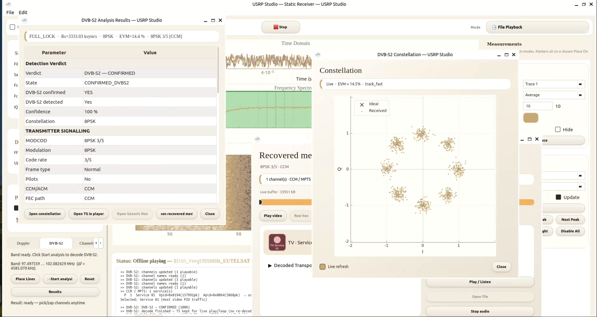<br/><sub>Result dialog + constellation — CCM, <code>FULL_LOCK</code></sub></p>

<p align="center">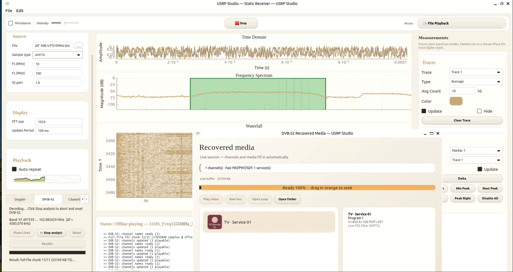<br/><sub>Offline (File Playback) session with recovered media</sub></p>

<p align="center">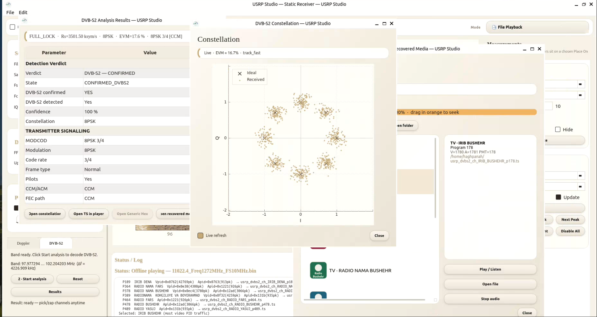<br/><sub>Constellation window — 8PSK</sub></p>

<p align="center">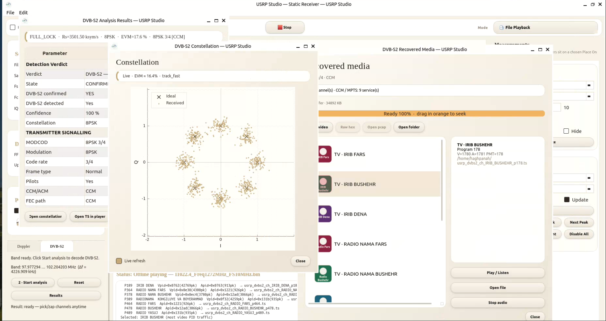<br/><sub>Multi-service (MPTS) recovered media</sub></p>

### 9.2 Playable Transport Stream

Decoded TS played in an external player (clean SPTS / remux):

<p align="center">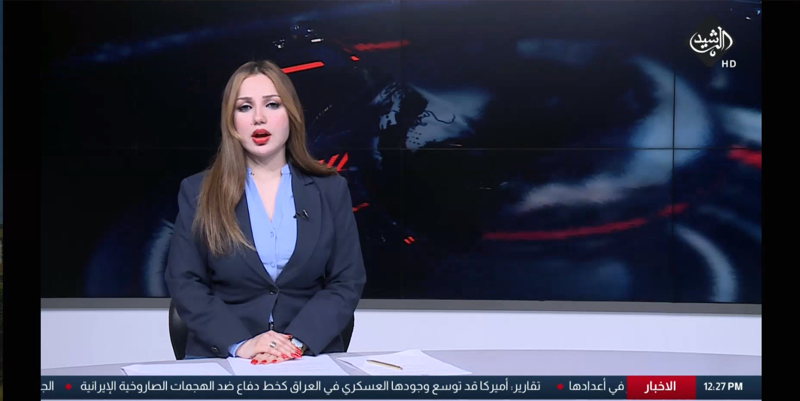</p>

### 9.3 Demo videos

<video src="docs/media/demo_dvbs2_decode.webm" controls width="720"></video>

<video src="docs/media/demo_dvbs2_recovered_media.webm" controls width="720"></video>

---

## 10. Channelizer — mathematical description

<p align="center">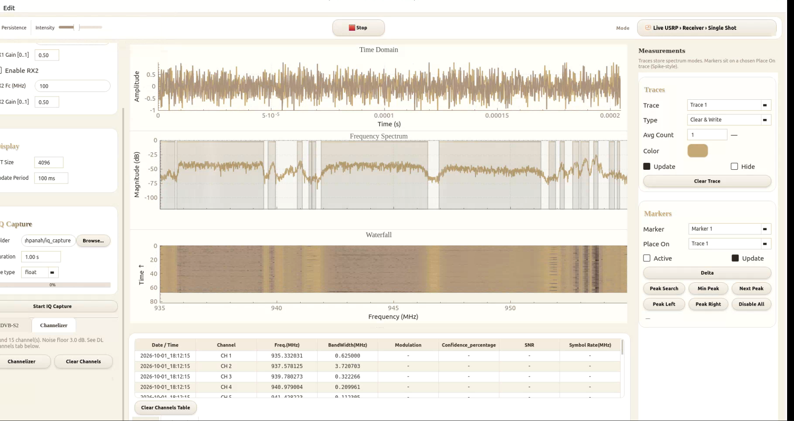<br/><sub>Live RX plot stack with Channelizer overlays, traces, markers, and the channel table</sub></p>

The Channelizer finds **occupied-bandwidth islands** inside a user-selected spectrum region (Live RX or Offline). Implementation: `Measurement/channelizer_engine.*`.

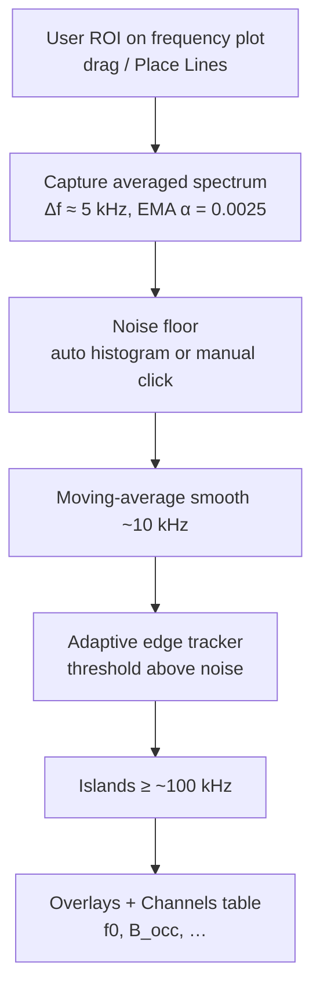
```mermaid
flowchart TB
  ROI["User ROI on frequency plot<br/>drag / Place Lines"] --> PSD["Capture averaged spectrum<br/>Δf ≈ 5 kHz, EMA α = 0.0025"]
  PSD --> NF["Noise floor<br/>auto histogram or manual click"]
  NF --> SM["Moving-average smooth ~10 kHz"]
  SM --> EDGE["Adaptive edge tracker<br/>threshold above noise"]
  EDGE --> CH["Islands ≥ ~100 kHz"]
  CH --> UI["Overlays + Channels table<br/>f0, B_occ, …"]
```

**UI flow:** open Channelizer → choose automatic or manual noise floor → the engine lists CH 1…N with center frequency and occupied bandwidth → colored bands are drawn on the spectrum.

### 10.1 Spectrum grid and input level

The capture pauses the display FFT and uses its own long FFT. $N$ is chosen so that $\Delta f = F_s/N \approx 5$ kHz. About 400 windowed frames are averaged ($\alpha = 0.0025$) on the **linear magnitude**:

$$
\overline{\lvert X\rvert}_t[k] = (1-\alpha)\,\overline{\lvert X\rvert}_{t-1}[k] + \alpha\,\lvert X_t[k]\rvert,
\qquad
D[k] = 10\log_{10}\overline{\lvert X\rvert}[k]\quad[\mathrm{dB\ (rel.)}]
$$

The ROI starts at full-grid index $k_0$, and bin frequencies follow §3.1:

$$
f[k] = f_c - \frac{F_s}{2} + (k_0 + k)\,\Delta f
$$

All levels and thresholds below ($D$, $\hat{N}_0$, $T$, edge scores) are in **dB (rel.)** — see [§3.3](#33-dbfs-vs-db-rel) for the relation to dBFS.

### 10.2 Noise-floor estimate (automatic)

Build a histogram of $D[k]$ with $N_b = 10$ level bins. Among the lowest $p = 30\,\%$ of bins, pick the modal bin $[\ell_m, \ell_{m+1}]$ and average the samples in it:

$$
\hat{N}_0 = \frac{1}{\lvert S\rvert}\sum_{k\in S} D[k],
\qquad
S = \bigl\{\, k : D[k]\in[\ell_m,\ell_{m+1}] \,\bigr\}
$$

Manual mode: the user clicks the noise floor on the plot.

### 10.3 Smoothing

Centered moving mean over a window of about 10 kHz:

$$
W = \left\lceil \frac{10\cdot 10^{3}}{\Delta f} \right\rceil,
\qquad
\tilde{D}[i] = \frac{1}{\lvert J_i\rvert}\sum_{j\in J_i} D[j],
\qquad
J_i = \bigl[\,i-\lfloor W/2\rfloor,\; i+\lfloor W/2\rfloor\,\bigr] \cap \mathrm{ROI}
$$

### 10.4 Adaptive edge tracker

**Detection threshold** above the noise floor:

$$
T = \hat{N}_0 + T_{\mathrm{margin}},
\qquad
T_{\mathrm{margin}} = 1\ \mathrm{dB\ (rel.)}\ \text{(default)}
$$

**Adaptive low threshold** while walking the spectrum ($a = 0.90$):

$$
T_{\mathrm{low}} \leftarrow a\,T_{\mathrm{low}} + (1-a)\,\tilde{D}[i]
$$

**Edge scores** on local left/right windows (≈ 50 kHz), with $b = 0.65$ and $b_2 = 1$:

$$
\begin{aligned}
A &= \bigl(b\,\mathrm{mean}_R + (1-b)\,\mathrm{max}_R\bigr) - \tilde{D}[i] \\
B &= \tilde{D}[i] - \bigl(b_2\,\mathrm{mean}_L + (1-b_2)\,\mathrm{min}_L\bigr) \\
C &= \bigl(b\,\mathrm{mean}_L + (1-b)\,\mathrm{max}_L\bigr) - \tilde{D}[i] \\
D_{\mathrm{e}} &= \tilde{D}[i] - \bigl(b_2\,\mathrm{mean}_R + (1-b_2)\,\mathrm{min}_R\bigr)
\end{aligned}
$$

- Rising spurious edge: $A > 1.5$ and $B < 0.5$ → restart the island.
- Falling edge: $C > 1.5$ and $D_{\mathrm{e}} < 0.5$ → close the island using contiguous “up” / “down” runs.
- Crossing below $T$ also finalizes $[i_{\min}, i_{\max}]$.

Minimum occupied width ≈ **100 kHz**.

### 10.5 Reported channel parameters

For each accepted bin range $[k_s, k_e]$:

$$
f_{\mathrm{start}} = f[k_s],
\qquad
f_{\mathrm{stop}} = f[k_e],
\qquad
B_{\mathrm{occ}} = f_{\mathrm{stop}} - f_{\mathrm{start}},
\qquad
f_0 = \tfrac{1}{2}\bigl(f_{\mathrm{start}} + f_{\mathrm{stop}}\bigr)
$$

These are drawn as Channelizer overlays and listed in the Channels table.

---

## 11. Panorama — sweep & stitch algorithm

Implementation: `panorama_usrp.*` (LO hop + IQ capture), `panorama_fft.*` (per-slot FFT), `MainWindow::stitchPanoSlot` (overlap merge).

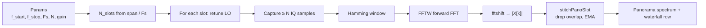
```mermaid
flowchart LR
  P["Params<br/>f_start, f_stop, Fs, N, gain"] --> N["N_slots from span / Fs"]
  N --> HOP["For each slot: retune LO"]
  HOP --> IQ["Capture ≥ N IQ samples"]
  IQ --> WIN["Hamming window"]
  WIN --> FFT["FFTW forward FFT"]
  FFT --> FFTS["fftshift → |X[k]|"]
  FFTS --> ST["stitchPanoSlot<br/>drop overlap, EMA"]
  ST --> DISP["Panorama spectrum + waterfall row"]
```

### 11.1 Slot grid

Given the span $[f_{\mathrm{start}}, f_{\mathrm{stop}}]$, slot bandwidth $B = F_s$, and hop step $B_{\mathrm{step}} < B$:

$$
N_{\mathrm{slots}} \approx 1 + \left\lceil \frac{f_{\mathrm{stop}}-f_{\mathrm{start}}-B}{B_{\mathrm{step}}} \right\rceil
$$

Adjacent slots overlap so FFT edges blend cleanly. Each slot center $f_c^{(s)}$ is tuned on the USRP, and `panoramaReceiver` fills a per-slot IQ buffer.

### 11.2 Per-slot spectrum

For slot $s$: normalize ($\tilde{x} = x/32768$) → Hamming window over $N$ samples → FFT → fftshift → magnitude $\lvert X_s[k]\rvert$, with $\Delta f = F_s/N$ (same definitions as §3.1).

### 11.3 Stitch + EMA

`stitchPanoSlot` keeps the **non-overlapping** interior of each slot and merges it into one panoramic vector. Across sweeps, each bin’s **linear magnitude** is EMA-smoothed ($\alpha = 0.1$) and then converted to dB (rel.):

$$
\overline{\lvert X_s\rvert}[k] \leftarrow (1-\alpha)\,\overline{\lvert X_s\rvert}[k] + \alpha\,\lvert X_s[k]\rvert,
\qquad
D[k] = 10\log_{10}\overline{\lvert X\rvert}[k]\quad[\mathrm{dB\ (rel.)}]
$$

The Panorama Y axis is therefore **dB (rel.)**, not dBFS: level differences read half their dBFS value ([§3.3](#33-dbfs-vs-db-rel)). The display may max-pool the long vector down to the plot width, and each finished sweep appends one row to the panorama waterfall.

### 11.4 UI linkage

- Left panel: Start/Stop Fc, Fs, gain, FFT res, sweep period.
- Right panel: the same **Traces / Markers** stack as Live RX (`panoSpectrumTraces_`), operating on $D[k]$.
- Status log: device serial, slot count, FFT size.

Screenshots: [§2.3](#23-panorama).

---

## 12. Build & run

### Dependencies

- Qt 6 (Widgets, PrintSupport, Svg, Multimedia, Network)
- UHD
- FFTW3 (+ threads / OpenMP)
- Boost (system, thread, filesystem, program_options)

### Build

Requires access to the private source repository ([request access](#source-code-availability)).

```bash
cd SpectraLab            # source repository root
mkdir -p build && cd build
qmake ../UsrpStaticRx/UsrpStaticRx.pro
make -j$(nproc)
./SpectraLab
```

Self-test (scope in [§7](#7-dvb-s2-implementation-coverage--validation)):

```bash
./SpectraLab --dvbs2-selftest
```

### Quick usage

1. Choose **Live USRP** or **File Playback**.
2. **Live RX:** set device args / $F_s$ / $f_c$ / gain → Start.
3. **File Playback:** pick the file, set **File Type**, $F_s$, $f_c$, IQ Gain ([§4](#4-iq-file-format)) → Play.
4. **Panorama / TX / TX-RX:** switch mode from the header selector.
5. **DVB-S2:** Place Lines (approximate) → Analyze (or Capture IQ first in live mode).
6. **Channelizer:** drag ROI → Channelizer → Automatic or Manual noise floor.

---

## 13. Demo media

Real SpectraLab / USRP sessions. Videos are cropped so only the application window is visible.

### 13.1 Screenshots

| File | Use in README |
|------|----------------|
| [splash.png](docs/media/splash.png) | Hero / product splash |
| [splash_channelizer.png](docs/media/splash_channelizer.png) | Splash slide — Channelizer concept (startup screen) |
| [splash_dvbs2.png](docs/media/splash_dvbs2.png) | Splash slide — DVB-S2 |
| [splash_apsk.png](docs/media/splash_apsk.png) | Splash slide — APSK constellation |
| [start_software.png](docs/media/start_software.png) | Mode menu / start UI (§2) |
| [panorama.png](docs/media/panorama.png) | Panorama running (§2.3) |
| [panorama_sweep.png](docs/media/panorama_sweep.png) | Panorama controls / sweep (§2.3) |
| [channelizer.png](docs/media/channelizer.png) | Live RX plots + Channelizer overlays + traces / markers (§10) |
| [dvbs2_result.png](docs/media/dvbs2_result.png) | DVB-S2 `FULL_LOCK` + constellation (§9.1) |
| [dvbs2_result_offline.png](docs/media/dvbs2_result_offline.png) | Offline decode + recovered media (§9.1) |
| [dvbs2_result_constellation.png](docs/media/dvbs2_result_constellation.png) | Constellation detail (§9.1) |
| [dvbs2_result_services.png](docs/media/dvbs2_result_services.png) | Multi-service recovered media (§9.1) |
| [dvbs2_recovered_video.png](docs/media/dvbs2_recovered_video.png) | Playable TV from decoded TS (§9.2) |
| `docs/media/dvbs2_frames/` | ETSI EN 302 307 frame figures (§6) |
| `docs/media/etsi_fig-*.png` / `dvbs2_report-*.png` | Spec / report pages |

### 13.2 Screencasts

| File | Content |
|------|---------|
| [demo_live_rx.webm](docs/media/demo_live_rx.webm) | Live RX — spectrum / waterfall / receive |
| [demo_live_rx_ui.webm](docs/media/demo_live_rx_ui.webm) | Live RX UI tour |
| [demo_panorama.webm](docs/media/demo_panorama.webm) | Panorama sweep (§2.3) |
| [demo_panorama_colormap.webm](docs/media/demo_panorama_colormap.webm) | Panorama + colormap editor |
| [demo_offline_playback.webm](docs/media/demo_offline_playback.webm) | Offline / File Playback (§2.6) |
| [demo_dvbs2_decode.webm](docs/media/demo_dvbs2_decode.webm) | DVB-S2 decode → recovered media (§9.3) |
| [demo_dvbs2_recovered_media.webm](docs/media/demo_dvbs2_recovered_media.webm) | Multi-service DVB-S2 recovered media (§9.3) |

<video src="docs/media/demo_live_rx.webm" controls width="720"></video>

<video src="docs/media/demo_live_rx_ui.webm" controls width="720"></video>

<video src="docs/media/demo_panorama_colormap.webm" controls width="720"></video>

---

## 14. References

1. ETSI EN 302 307 — *Digital Video Broadcasting (DVB); Second generation framing structure, channel coding and modulation systems for Broadcasting, Interactive Services, News Gathering and other broadband satellite applications (DVB-S2)*.
2. Project notes & MATLAB physical-layer work: `report_DVBS2_physical_layer.pdf` and scripts (local archive).
3. In-tree path doc: `UsrpStaticRx/dvbs2/docs/CCM_ACM_PATH.md` (private repository).

---

<p align="center">
  <b>SpectraLab</b> — Live RX · TX · Panorama · Channelizer · DVB-S2 · IQ Analysis<br/>
  <sub>Source code is private — <a href="#source-code-availability">request access</a></sub>
</p>
